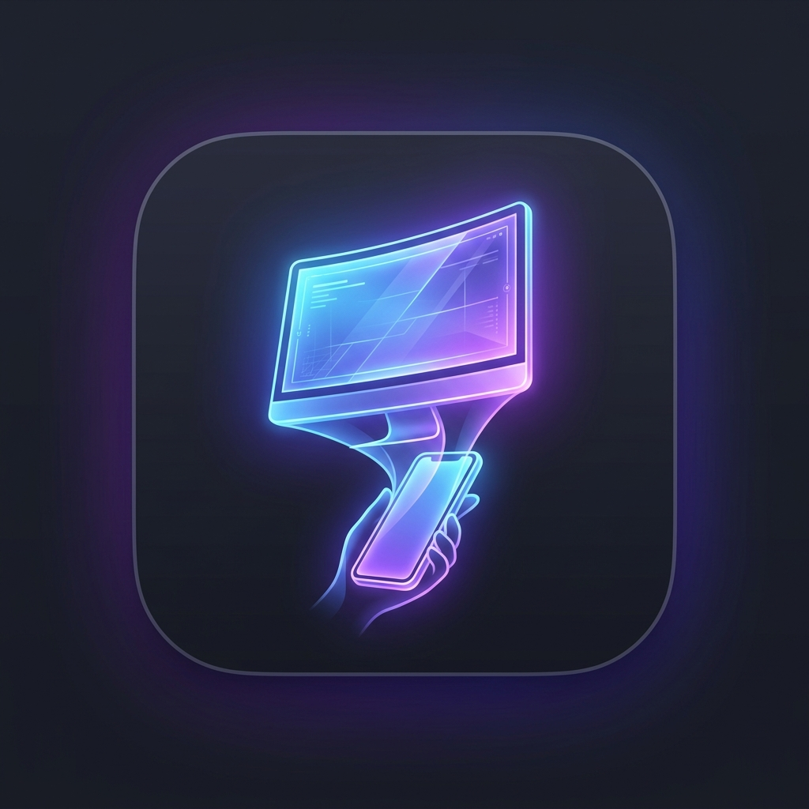

# Pocket Desktop — iPhone Client (iOS 17+)

<p align="center">
  
</p>

<p align="center">
  <b>Your computer. In your pocket.</b><br>
  A production-ready native iOS client that turns desktop computing into a clean, mobile-first experience — without shrinking a whole desktop down to a tiny phone screen.
</p>

---

## 🚀 Key Features

* **Simplified Desktop (Mobile-First):** Shows open windows as cards with thumbnails, focus, minimize, and close actions — rather than an unreadable whole-screen mirror.
* **Simplified Browser:** Controls remote desktop browser sessions (Chrome, Edge, Safari) with mobile URL search, tab cards, back/forward, and bookmarks.
* **Remote Trackpad:** MacBook-style multi-touch surface supporting drag, tap-to-click, natural scrolling, and gentle haptic feedback (`UIImpactFeedbackGenerator`).
* **Remote Keyboard:** System iOS keyboard paired with desktop modifier keys (`Esc`, `Tab`, `Ctrl`, `Alt`, `Shift`, `Win/Cmd`, Arrow keys) and clipboard shortcuts (`Copy`, `Paste`, `Undo`, `Redo`).
* **App Launcher:** Searchable grid of desktop apps with live running indicators and favorites.
* **Remote Files:** Browse allowed desktop folders (`Desktop`, `Documents`, `Downloads`, `Pictures`), download files into the iOS app sandbox, and share via the native iOS Share Sheet.
* **Quick Actions & Media:** Volume slider, playback controls (`Previous`, `Play/Pause`, `Next`), lock PC, sleep PC, and instant screenshot capture.
* **Live Desktop (When You Need It):** Real-time WebRTC screen stream with auto-hiding overlay HUD, pan/zoom, and precision touch-coordinate mapping handling letterboxing and display scale.
* **End-to-End Security:** Curve25519 key agreement, SHA-256 fingerprint verification, AES-GCM session encryption, Face ID lock, and App Switcher privacy blur.

---

## 🛠 Architecture

```
PocketDesktop/
├── .github/workflows/build-ipa.yml   # Automated GitHub Actions CI for .ipa builds
├── PocketDesktop.xcodeproj/         # Xcode project configuration & schemes
├── PocketDesktop/
│   ├── App/                         # PocketDesktopApp (@main), AppState
│   ├── Core/
│   │   ├── Protocol/                # PocketMessage, DeviceIdentity, DesktopModels, InputEvents
│   │   ├── Crypto/                  # CryptoKit, Curve25519, AES-GCM, Fingerprints
│   │   ├── Storage/                 # KeychainService, DeviceRepository, FileSandboxService
│   │   ├── Networking/              # SignalingClient (WebSocket), LatencyMonitor, ConnectionManager
│   │   ├── WebRTC/                  # WebRTCManager, TouchCoordinateMapper
│   │   └── Security/                # FaceIDAuthManager, PrivacyBlurManager
│   ├── DesignSystem/                # Colors, Haptics, GlassCard, LatencyBadge, PocketButton
│   ├── Features/                    # 20 Distinct Screens (Splash, Onboarding, Pairing, Desktop, etc.)
│   ├── Services/                    # DemoDesktopService (Decoupled demo mode)
│   └── Resources/                   # AppIcon (1024x1024), Info.plist
└── PocketDesktopTests/              # XCTest suite for Protocol, Crypto, and Coordinates
```

---

## 📲 How to Install the `.ipa` on Your iPhone

This repository features an automated GitHub Actions workflow (`.github/workflows/build-ipa.yml`) that builds `PocketDesktop.ipa` on macOS runners with Xcode 15/16.

### Option 1: Sideloadly (Windows / macOS)
1. Download `PocketDesktop.ipa` from the **Releases** or **Actions Artifacts** tab.
2. Connect your iPhone to your computer via USB.
3. Open **Sideloadly**, drag & drop `PocketDesktop.ipa` into the window.
4. Enter your Apple ID and click **Start**.
5. On your iPhone, go to **Settings > General > VPN & Device Management** and trust your developer certificate.

### Option 2: AltStore (Over-the-Air)
1. Download `PocketDesktop.ipa` directly in Safari on your iPhone.
2. Open **AltStore > My Apps**.
3. Tap the **`+`** icon in the top-left corner and select `PocketDesktop.ipa`.
4. AltStore signs and installs the application.

### Option 3: TrollStore (Jailbroken / CoreTrust Vulnerability)
1. Download `PocketDesktop.ipa`.
2. Share to **TrollStore** for permanent, re-sign-free installation.

---

## 🔐 Security & Privacy

1. **Keychain Private Keys:** Identity keys generated via `CryptoKit` are stored in hardware-backed iOS Keychain (`kSecAttrAccessibleAfterFirstUnlockThisDeviceOnly`).
2. **Authenticated Pairing:** Pairing occurs via cryptographic challenge-response using the desktop's public key fingerprint.
3. **No Keystroke Logging:** Remote keyboard text is transmitted transiently over the encrypted DataChannel and immediately zeroed from memory.
4. **App Switcher Blur:** When entering the iOS App Switcher or background, the screen is automatically protected by an ultra-thin privacy material overlay.
5. **Biometric Protection:** Users can enable Face ID / Touch ID authentication in settings before accessing computer controls.

---

## 🧪 Unit Testing

Run unit tests directly with `xcodebuild`:

```bash
xcodebuild test \
  -project PocketDesktop.xcodeproj \
  -scheme PocketDesktop \
  -destination 'platform=iOS Simulator,name=iPhone 15'
```

Includes tests for:
- `testProtocolSerialization`: Framing and JSON payload validation.
- `testCryptoKeyAgreementAndEncryption`: Curve25519 ECDH exchange and AES-GCM seals.
- `testCoordinateMapping`: AspectFit letterboxing and touch rejection in margins.
- `testDeviceRepositoryManagement`: Device addition, settings update, and key deletion.
